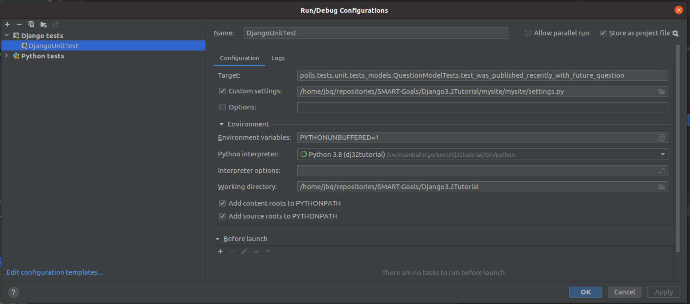

**Following Official Pycharm Help Page**
[Pycharm Run/Debug Configuration: Django Test](https://www.jetbrains.com/help/pycharm/run-debug-configuration-django-test.html):

Configuration for one single test in file [DjangoUnitTest.run.xml](./DjangoUnitTest.run.xml)

**Following Pycharm Tutorial Page**
[Writing and running unit tests in Django](https://www.jetbrains.com/pycharm/guide/tutorials/django-aws/unit-tests/):

This is too big to insert it here, specially since it's part of a
[tutorial](https://www.jetbrains.com/pycharm/guide/tutorials/django-aws/) with its own
[Django project source files](https://github.com/mukulmantosh/SampleDemo/tree/master/SampleDemo).